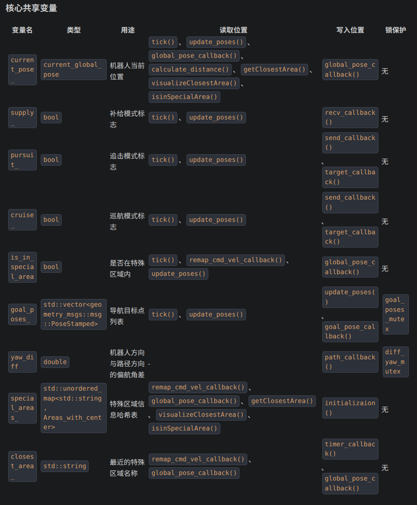
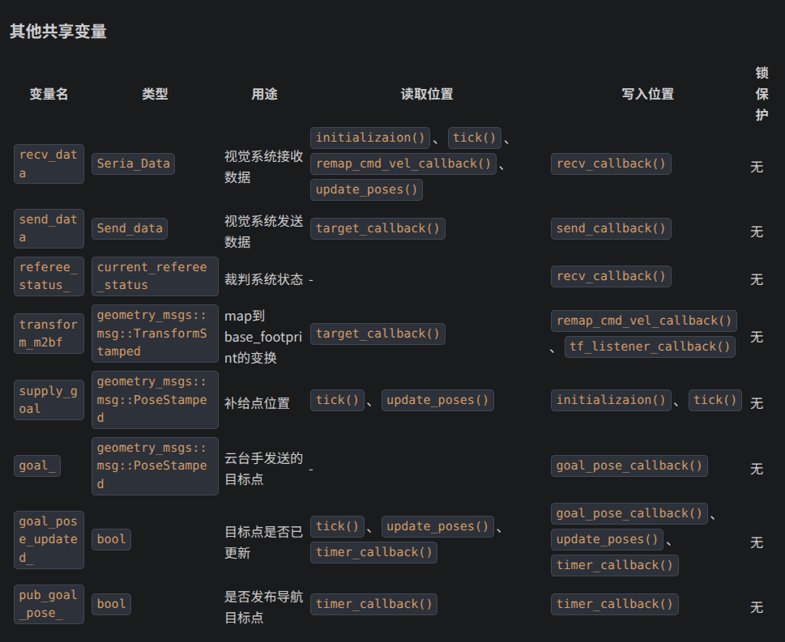

# 解释
## 一、Behavior Tree概念解释
### 一、tick
1. 为什么需要 Tick？
    - 机器人的环境是动态变化的（比如追击目标移动、血量下降、突然需要清地图），BT 需要 “周期性” 地感知环境、更新决策、执行动作 ——tick就是 BT 的 “心跳”，你的代码里tree.tickRoot()每 20ms 触发一次，就是让 “决策大脑” 每 20ms 思考一次。
2. Tick 的本质：深度优先的 “遍历 + 执行”
    - tick不是 “只检查状态”，而是从根节点开始，递归触发所有子节点的tick()回调函数，完成 “遍历 + 执行”：
        - 遍历：按树的层级（根→控制节点→子节点→装饰器→动作 / 条件节点）逐个触发节点；
        - 执行：每个节点的tick()回调是其核心逻辑入口，不同节点的tick()干的事不同（见下表）。

| 节点类型 | tick()回调的核心逻辑 | 树中例子（50Hz tick 时） | 
| -------- | -------- | ------------ | 
| 条件节点 | 读取黑板数据，判断真假，返回SUCCESS/FAILURE | Status读navigate_to_pose_status，若为 true 则返回 SUCCESS，触发导航覆盖子树 |
| 动作节点 | 执行具体操作，返回对应状态 | `pubRobotStatus`：更新所有黑板变量，返回 SUCCESS；`FollowPath`：发布机器人速度指令，返回 RUNNING（直到到目标）；`ClearEntireCostmap`：调用清地图服务，返回 SUCCESS/FAILURE|
| 控制节点 | 按规则遍历子节点，根据子节点状态返回自己的状态 | `ReactiveSequence`：先执行GameStart，再执`pubRobotStatus`，只要有一个失败就返回 FAILURE；`Parallel`：同时遍历两个WhileDoElse，满足成功阈值（2）则返回 SUCCESS|
| 装饰器节点 | 先判断规则，再决定是否触发子节点的tick() | `RateController`：检查是否过了 20ms，是则触发子节点（路径规划），否则直接返回 SUCCESS；`KeepRunningUntilFailure`：触发子节点tick()，若子节点返回 RUNNING 则自己也返回 RUNNING，若子节点返回 FAILURE 则自己返回 SUCCESS |

- **==对与C++behaviorTree来说，50Hz（20ms周期）这个数字是跑完整个树绰绰有余的，C++是以us为单位的，最耗时间的计算路径也就5～10ms，加起来不会超过10ms==**
- **==下一次tick来之前，空闲时间里这个线程是休眠状态==**
### 二、节点

| 节点类型 | 核心作用 | 树中对应例子 | 状态 | 
| -------- | ---- | ---- | ---- |
| 条件节点（Condition Node） | 检查某个条件是否为真 | GameStart（检查游戏是否启动）、Status（检查各类状态）| 只有SUCCESS/FAILURE |
| 动作节点（Action Node） | 执行具体操作（有副作用，会改变环境 / 黑板） | pubRobotStatus（更新黑板状态）、FollowPath（发布运动指令）、ClearEntireCostmap（清代价地图）| 有RUNNING/SUCCESS/FAILURE |
| 控制节点（Control Node）| 	管理子节点的执行顺序 / 逻辑 | ReactiveSequence（反应式序列）、Parallel（并行）、WhileDoElse（条件循环）| 状态由子节点决定| 
| 装饰节点（Decorator Node） | 修饰单个子节点的执行逻辑 | RateController（限流）、KeepRunningUntilFailure（持续运行直到失败）| 包裹子节点，修改其执行规则|
### 三、核心状态
每个节点只有 4 种状态，这是 tick 机制的 “通信语言”：
- IDLE：初始状态（节点还没被执行过）；
- SUCCESS：执行成功（比如GameStart检查到游戏已启动）；
- FAILURE：执行失败（比如Status检查到hp_status=false）；
- RUNNING：执行中（比如FollowPath正在让机器人移动，还没到目标）。
### 四、黑板（Blackboard）：BT 的 “全局变量”
你树里的{hp_status}/{cruise_goal}/{target_goal}都是黑板变量 —— 所有节点通过黑板共享数据，比如：
- pubRobotStatus（动作节点）把机器人的血量、目标位置等 “写” 到黑板；
- Status（条件节点）从黑板 “读”hp_status，判断是否需要补血；
- ComputePathToPose（动作节点）从黑板 “读”target_goal，规划追击路径。
## 二、从xml入手
### 一、whiledoelse
- 先判断第一个节点（一般是状态等）（用true，false）
   - 返回true：代表需要执行这个动作，进入中间节点的do循环，直到第一个状态变为false
   - 返回false：代表不需要执行这个动作，直接进入else的结果节点
### 二、parallel
- 并行执行所有子节点
   - 返回success：代表所有子节点都执行成功
   - 返回failure：代表有子节点执行失败
   - 一个成功一个失败：持续等待，因为导航本就是需要一定运行时间的
### 三、sequence
#### 3.1 普通sequence
- 顺序执行所有子节点，先执行第一个
   - 返回success：再执行第二个
   - 返回failure：则整个 Sequence 立即返回 FAILURE，后续节点不执行
   - 若所有子节点都返回 SUCCESS，则整个 Sequence 返回 SUCCESS
#### 3.2 ReactiveSequence
- 先执行第一个
   - 返回success：再执行第二个
   - 执行每个子节点前，重新检查前面所有已执行节点的状态
   - ==若任何前面的节点状态变为 FAILURE，则整个 ReactiveSequence 立即返回 FAILURE，后续节点不执行==
   - 所有节点都success，返回success
#### 3.3 pipelineSequence
- ==子节点按顺序启动，但前面的节点可以持续运行并更新数据==
- 后面的节点基于前面节点产生的最新数据执行，无需等待前面节点完全结束
- **通常结合 RateController（控制更新频率）和 KeepRunningUntilFailure（持续运行）使用**
### 四、运行完所有子节点
- 重新启动决策树
## 三、子树
### 1.navigate_override_subtree(==云台手发送目标点==)
- 以50Hz的频率重复执行内部节点
    - sequence
        - GoalUpdater(==Nav2行为树库提供的标准节点==)
            > GoalUpdater是你自定义的装饰器节点（非 Nav2 原生），核心是 “预处理目标位姿”，配合逻辑：
            - Tick 触发时：BT 遍历到GoalUpdater，触发其tick()回调；
            - 读取黑板参数：从黑板读取input_goal（比如追击的target_goal）；
            - 目标预处理：执行你自定义的逻辑（比如修正目标坐标、过滤无效目标、跟踪动态目标）；
            - 更新黑板：把处理后的目标写入output_goal（updated_target_goal）；
            - 触发子节点：作为装饰器，它会触发子节点ComputePathToPose的tick()，把预处理后的目标传给路径规划。
        - TruncatePath(==Nav2行为树库提供的标准节点==)
            - 将计算出的路径截断到距离目标仅0.01米的位置
            - 输入：完整路径{goal_path_override}
            - 输出：截断后的路径{truncated_goal_path_override}
            - 作用：避免机器人过度接近目标导致的精度问题
    - KeepRunningUntilFailure：持续执行子节点，直到子节点返回FAILURE
        - FollowPath(==Nav2行为树库提供的标准节点==)
            - 使用当前配置的控制器（{current_controller}）执行路径跟随
            - 跟随的路径是经过截断处理的{truncated_goal_path_override}
            - 持续调整机器人运动，确保沿规划路径移动
> 一些解释：1. pipelineSequence会先启动左边的50Hz的GoalUpdater，然后==马上==启动右边的keepRunningUntilFailure->followPath
> 2.50Hz的作用是不断更新目标点，不会重新启动导航
> 2.1当是云台发送目标、巡航、加血时，目标点是不动的，这时50Hz的作用就是不断计算新的路径，保证路径的实时性
> 2.2当是追击时，目标点是会变化的，这时就必须更新目标点和路径了，要不然完成不了任务
### 2. 其他树结构相同
- 追击设计成截断2.6dm
- 巡航、加血设计成截断0.1dm
- 把加血、追击、巡航的goal换成supply_goal、target_goal、cruise_goal

## 四、打断、抢占机制
- 首先明确BT的优先级：
    - 从形状上来看，whiledoelse系列节点，从上至下，优先级从高到低
    - 在本树中：云台手覆盖 > 加血 > 追击 > 巡航
- **每次tick都有检查所有状态，并从树的根开始执行（条件节点做判断，动作节点做执行），那么如果一个高优先级的状态被更新时置true，高优先级会直接执行相应动作**
    - 但是tick从root开始执行是ReactiveSequence特有的
    - 如果是普通sequence，那么会从running的节点开始tick

## 五、BT与Nav2的配合
- **RUNNING 节点在两次 Tick 之间，不会 “停留” 在 BT 的决策逻辑里，但 FollowPath 的底层运动指令会持续生效。核心是要区分「BT 的离散 Tick」和「ROS2 Action 的异步执行」：**
    - ==异步：他们的运行互不影响，BT的休眠不会影响Nav2的运动==
    - BT只是发送指令，运动由Nav2动作服务器完成
    - 具体场景拆解（第 10ms 跑到 FollowPath，到 20ms 下一次 Tick 前）
        - 0~10ms：BT 执行 Tick，遍历到巡航的 FollowPath，触发其tick()回调：
        - FollowPath 的回调逻辑：向 Nav2 的FollowPath Action 服务器发送「继续执行」的请求；
        - Nav2 控制器收到请求后，异步发布机器人的速度指令（比如线速度 0.5m/s，角速度 0rad/s）；
        - BT 的 Tick 执行完成（耗时 10ms），返回主循环，执行loop_rate.sleep()休眠。
        10~20ms：
        - BT 的决策逻辑完全 “休眠”（没有任何 BT 节点在执行）；
        - Nav2 控制器仍在持续发布速度指令。==因为 Action 是异步的，不会因为 BT 休眠而停止==
        - 机器人按这个速度持续移动，直到 20ms 下一次 Tick 到来。
- ==**BT 里的ComputePathToPose、FollowPath等节点，不是 “直接算路径 / 发速度”，而是Nav2 核心节点的 “客户端”；**==
    - 他代替了导航时认为发送目标点
    - Nav2 的nav2_planner（路径规划）、nav2_controller（运动控制）是 “服务端”，独立运行；
## 六、两个50Hz
- 两个计时器公用一个时间线，因此每次触发root的50Hztick，ratecontroller也会同时触发（因为20ms>=20ms）


## 七、GameStart代码详细理解
1. callback_group:互斥回调组
    - 核心设计目的是**保证回调组内的所有回调函数不会同时执行，从而避免线程安全问题。**
    - GameStart类：
        - 类中有共享变量is_game_start，在is_game_start_callback中会被修改
        - 如果没有互斥机制，当多个回调同时执行时，可能导致is_game_start的状态不一致（竞态条件）
        - 互斥回调组确保了对共享资源的安全访问，无需额外添加互斥锁或原子操作，简化了代码实现
        ```cpp
        callback_group_ = node_->create_callback_group(
            rclcpp::CallbackGroupType::MutuallyExclusive, false);
        ```
        - 参数1：rclcpp::CallbackGroupType::MutuallyExclusive
            - MutuallyExclusive：互斥型，组内回调函数不能同时执行
            - Reentrant：可重入型，组内回调函数可以同时执行（需要开发者自己保证线程安全）
        - 这个参数名为automatically_add_to_executor_with_node，表示：
            - true（默认）：自动将此回调组添加到与节点关联的默认执行器中
            - false：不自动添加，需要开发者手动将其添加到指定执行器中
2. 单线程执行器（SingleThreadedExecutor）
    - **在一个独立线程中执行所有回调函数的执行器。设计它的主要原因是：**
        - 确保回调函数按顺序执行，避免并发执行导致的线程安全问题
        - 简化代码，无需手动管理线程同步
    - 参数：
    ```cpp
    callback_group_executor_.add_callback_group(callback_group_, node_->get_node_base_interface());
    ``` 
    - 参数1：callback_group_：要添加到执行器的回调组
    - 参数2：node_->get_node_base_interface()：节点的基础接口，用于执行器与节点的交互
    - 用法：
        - tick中调用`callback_group_executor_.spin_some();`
        - `spin_some()`:执行当前回调组中所有待处理的回调函数，执行完后立即返回
        - **这确保了回调函数只在行为树节点的tick()周期内执行，与行为树的执行节奏同步**
3. sub_option
    - **用于精细化配置订阅者行为的机制**
    - `sub_option.callback_group = callback_group_;`这行代码将is_game_start_callback回调函数明确分配到之前创建的互斥回调组中，确保它遵循互斥执行的规则。
4. **==设计理念==**
    - 原先如果这些订阅者订阅的话题出现了新的消息，回调函数原本是会立即执行去更新状态的，现在是需要等到行为树tick到的时候一起执行
    - 每次tick的时候，先把该执行的回调先执行，去更新状态再判断是不是游戏开始
> 如果有多个订阅者，都用互斥回调组，那么代码应该是
- GameStart.cpp
```cpp
// 展示参数化列表的Node
Node("GameStart")
    {
        // 创建ROS 2节点实例
        node_ = std::make_shared<rclcpp::Node>("GameStartNode");
        
        // 创建单个互斥回调组，供所有订阅者共享
        callback_group_ = node_->create_callback_group(
            rclcpp::CallbackGroupType::MutuallyExclusive, false);
        
        // 将回调组添加到单线程执行器
        callback_group_executor_.add_callback_group(callback_group_, node_->get_node_base_interface()); 
        
        // 创建订阅选项并设置同一个回调组
        rclcpp::SubscriptionOptions sub_option;
        sub_option.callback_group = callback_group_;
        
        // 订阅者1：游戏状态
        referee_sub_ = node_->create_subscription<hnurm_interfaces::msg::VisionRecvData>(
            referee_topic,
            rclcpp::SystemDefaultsQoS(),
            std::bind(&GameStart::is_game_start_callback, this, std::placeholders::_1),
            sub_option);
        
        // 订阅者2：机器人状态
        robot_status_sub_ = node_->create_subscription<hnurm_interfaces::msg::RobotStatus>(
            robot_status_topic,
            rclcpp::SystemDefaultsQoS(),
            std::bind(&GameStart::robot_status_callback, this, std::placeholders::_1),
            sub_option);
        
        // 订阅者3：环境数据
        env_data_sub_ = node_->create_subscription<hnurm_interfaces::msg::EnvironmentData>(
            env_data_topic,
            rclcpp::SystemDefaultsQoS(),
            std::bind(&GameStart::environment_data_callback, this, std::placeholders::_1),
            sub_option);
    }
BT::NodeStatus GameStart::tick()
    {
        // 执行所有回调组中的待处理回调
        callback_group_executor_.spin_some();
        
        // 根据多个状态判断游戏是否可以开始
        if(is_game_start && robot_health > 50 && environment_temperature < 40.0)    
        {   
            RCLCPP_INFO(this->get_logger(), "GameStart with good robot status and environment!");
            return BT::NodeStatus::SUCCESS;    
        }
        else 
        {   
            RCLCPP_INFO(this->get_logger(), "GameStart conditions not met!");
            return BT::NodeStatus::FAILURE ;   
        }
    }

    // 原有回调实现
    void GameStart::is_game_start_callback(const hnurm_interfaces::msg::VisionRecvData::SharedPtr gamestaus)
    {
        float gamestart = gamestaus->game_progress;
        if(gamestart > 3.5)
        {
            is_game_start = true;
        }
    }

    // 新增回调1：机器人状态处理
    void GameStart::robot_status_callback(const hnurm_interfaces::msg::RobotStatus::SharedPtr robot_status_)
    {
        robot_health = robot_status_->health;
        RCLCPP_INFO(node_->get_logger(), "Robot health: %d", robot_health);
    }

    // 新增回调2：环境数据处理
    void GameStart::environment_data_callback(const hnurm_interfaces::msg::EnvironmentData::SharedPtr env_data_)
    {
        environment_temperature = env_data_->temperature;
        RCLCPP_INFO(node_->get_logger(), "Environment temperature: %.2f", environment_temperature);
    }
```
- GameStart.hpp
```cpp
private:
        // 原有回调
        void is_game_start_callback(const hnurm_interfaces::msg::VisionRecvData::SharedPtr game_state_);
        // 新增回调1
        void robot_status_callback(const hnurm_interfaces::msg::RobotStatus::SharedPtr robot_status_);
        // 新增回调2  
        void environment_data_callback(const hnurm_interfaces::msg::EnvironmentData::SharedPtr env_data_);

        // ROS 2 节点实例
        rclcpp::Node::SharedPtr node_;
        // 单个互斥回调组，供所有订阅者共享
        rclcpp::CallbackGroup::SharedPtr callback_group_;
        // 单线程执行器
        rclcpp::executors::SingleThreadedExecutor callback_group_executor_;
        
        // 多个订阅者
        rclcpp::Subscription<hnurm_interfaces::msg::VisionRecvData>::SharedPtr referee_sub_;
        rclcpp::Subscription<hnurm_interfaces::msg::RobotStatus>::SharedPtr robot_status_sub_;
        rclcpp::Subscription<hnurm_interfaces::msg::EnvironmentData>::SharedPtr env_data_sub_;
        
        // 主题名称
        std::string referee_topic;
        std::string robot_status_topic;
        std::string env_data_topic;

        // 共享状态变量
        bool is_game_start;
        int robot_health;
        float environment_temperature;
```

## 八、pubRobotStatus.hpp头文件
1. 原子类型
    - 设计意图：
        - 原子类型确保多线程环境下的线程安全访问
        - 避免使用互斥锁带来的性能开销
        - 提供快速的读写操作和状态检查
    - 例1
        - 控制状态
        ```cpp
        std::atomic<bool> on_control = false;
        ``` 
        - 表示机器人当前是否处于某种控制状态（可能是后端摄像头控制或其他特定控制模式）
2. 互斥锁
    - 设计意图：
        -  保护referee_status_结构体的线程安全访问
        -  防止多线程同时读写裁判系统数据导致的数据竞争
        -  确保数据一致性，避免出现部分更新的中间状态
3. 原子类型和互斥锁解释：
- 进程与线程
    - 进程：
        - 可以抽象理解为一个应用（浏览器，ide）被操作系统抽象的实例
        - 包括应有的资源（内存、文件描述符、打开的文件等、CPU）
        - 每个进程都有自己的地址空间，互不干扰
    - 线程：
        - 一个大工厂里的不同产线，并行完成，共享设备和资源
        - 比如浏览器里，一个线程负责加载页面，一个线程负责下载文件，一个线程响应用户点击
        - 是进程内的执行单元
        - 共享进程的资源（如内存、文件描述符等）
        - 每个线程有自己的执行栈和程序计数器
- 为什么要有线程？
    - 因为线程比进程更轻量：创建 / 销毁线程的开销远小于进程，而且线程间共享内存，协作起来更高效。比如你要同时处理多个任务，用多线程比多进程更省资源。
- 安全问题：竞态条件
    - 举例：
        - 多个线程共享内存是优势，但也会带来问题 ——多个工人同时抢用同一个工具 / 材料，会把事情搞砸。
        - 假设我们有一个计数器count = 0，让 2 个线程各自对它执行 1000 次count++，预期结果是2000，但实际运行可能得到1500甚至1000，这是为什么？
        - 如果两个线程的这三步「穿插」执行，就会出问题：
            - 线程 A 先读count=0，还没来得及加 1 写回；
            - 线程 B 也读了count=0；
            - 线程 A 加 1 变成1，写回内存；
            - 线程 B 加 1 也变成1，再写回内存。
        - 最后，count 变成了1，而不是执行两次应有的2
    - 解决思路：**==让操作「不可打断」：要么全做完，要么没做，不能被其他线程打断。==**
- 解决方案：
    - C++：**互斥锁（std::mutex）——「排队用资源」**
        - mutex 的本质是「锁」，给共享资源加一把锁：
            - 一个线程想要操作共享资源，必须先「拿到锁」；
            - 操作完成后，必须「释放锁」；
            - 如果锁已经被其他线程拿走了，当前线程就只能「排队等」，直到锁被释放。
        - 通常用std::lock_guard自动管理锁（RAII 机制）：
        - `std::lock_guard<std::mutex> lock(mtx);`
    - C++：**原子操作(std::atomic)**
        - 解释： 
            - 刚才我们说count++不是原子操作，但 CPU 本身提供了一些「原子指令」—— 可以一次性完成读 - 改 - 写的操作，中间不会被打断。
            - std::atomic就是 C++ 对 CPU 原子指令的封装：把共享变量声明为std::atomic<T>类型后，对它的常见操作（比如++、--、=）都会变成原子操作，不需要手动加锁。
        - 性能高和问题：
            - 互斥锁虽然通用，但有个问题：开销大。当线程拿不到锁时，会被操作系统「挂起」（上下文切换）—— 操作系统需要保存当前线程的状态，切换到其他线程执行，等锁释放后再唤醒这个线程。这个切换过程要消耗不少 CPU 资源。
            - 而std::atomic直接用 CPU 的原子指令实现，不需要操作系统介入，没有上下文切换的开销，性能比互斥锁高得多。但它的局限性也很明显：只能保证「单个变量的单个操作」是原子的，无法保护复杂的代码块。


## 九、多继承和单继承
- **==其实GameStart和pubRobotStatus.hpp都使用的成员变量`rclcpp::Node::SharedPtr node_;`通过`node_->function()`调用ROS2的功能==**
- **==其实GameStart没有必要再继承rclcpp::Node，因为它只是一个简单的状态发布器，不需要复杂的ROS2功能==**
- **==更改：直接删除继承即可==**
```cpp
class GameStart : public BT::ConditionNode {
```

## 十、话题加不加`/`
- **==加'/'那么这个话题就在全局命名空间下==**
- **==不加'/'那么这个话题就在当前命名空间下==**
    - 如果加'/'：直接使用`/goal_update`
    - 比如再robot1空间下，话题会变成`/robot1/goal_update`


## 十一、发布话题信息没有使用sub_option，发布频率？受不受到tick影响
- **==发布话题信息没有使用sub_option，发布频率有的按timer，有的按照tick（在回调里面）==**
- timer: special_areas_pub_
- tick: cmd_vel_remap_pub_（remap_cmd_vel_callback）、marker_pub_（visualizeClosestArea()）等等...==看注释==
## 十二、回调函数tick理解？回调实时性？
- 高复杂度：
    1. remap_cmd_vel_callback (视觉回调组)
        - TF变换查找（可能阻塞）
        - 欧拉角转换
        - PID控制器计算
        - 速度重映射发布
    2. global_pose_callback (普通回调组)
        - 多边形平均位置计算
        - 巡航目标点管理
        - 特殊区域可视化
        - 点在多边形内检测（射线法）
        - 目标姿态更新  
    3. timer_callback (视觉回调组，10ms频率) 
        -  
- 低复杂度
    - recv_callback: 视觉数据接收和状态更新
    - send_callback: 目标状态切换（追击/巡航）
    - target_callback: 目标位置计算
    - goal_pose_callback: 目标位姿更新
    - path_callback: 路径方向计算
- 优化==**【参考】**==
- 调整回调组策略：将时间敏感的回调（如速度重映射）移到独立的回调组
## 十三、pub代码问题
1. 为什么要设计两个回调组？ -》视觉回调组在tick里面先执行，确保视觉信息先被处理
- 视觉数据回调组 (callback_group_for_vision_data)
    - recv_sub_: /vision_recv_data - 视觉接收数据
    - odom_sub_: /odom - 里程计数据，**当前为空实现**
    - cmd_vel_sub_: /cmd_vel - 速度命令
    - timer_: 10ms定时器 (timer_callback)
- 普通回调组 (callback_group_)
    - back_target_sub_: /back_target - 后视目标（当前为空实现）
    - send_sub_: /vision_send_data - 视觉发送数据
    - target_sub_: /target - 目标检测数据
    - global_pose_sub_: /global_costmap/published_footprint - 全局位置
    - goal_pose_override_sub_: /goal_pose_override - 目标位姿覆盖
    - path_sub_: /path - 导航路径
    - tf_listener_timer_: 1000ms定时器 (tf_listener_callback)  
    - timer_callback:10ms,**==但是在tick回调组里运行，因此一次tick会有跑两次定时器回调，更新周期还是tick的20ms==**
- **两个回调组**：
    - 设计目的应该是两个回调组并行执行，回调组内部串行执行，这样可以保证一些实时性高的可以不被阻塞
    - 视觉相关回调（如速度重映射）通常实时性要求更高
        - 比如速度重映射 
    - 分离回调组可以避免非关键回调阻塞关键回调的执行
        - 实现资源隔离：避免一个功能域的回调异常影响另一个功能域
        - 逻辑分离：将视觉控制和导航决策的回调分开，便于维护和调试

.hpp
```cpp
// 把单线程执行器换成多线程 rclcpp::executors::SingleThreadedExecutor -> rclcpp::executors::MultiThreadedExecutor
rclcpp::executors::MultiThreadedExecutor Multi_callback_executor_;
```
.cpp
```cpp
// 添加两个回调组
executor_->add_callback_group(callback_group_, node_->get_node_base_interface());
executor_->add_callback_group(callback_group_for_vision_data, node_->get_node_base_interface());

 // 启动执行器线程
    executor_thread_ = std::thread([this]() {
        executor_->spin();
    });
```

- 风险：
    - 共享资源访问：对共享变量（如current_pose_、is_in_special_area等）的访问需要加锁
    - 回调顺序：并行执行可能改变回调的执行顺序，需要确保逻辑正确性
    - 死锁避免：避免循环依赖和嵌套锁
    - 资源消耗：多线程会增加内存和CPU消耗，需要根据硬件资源调整线程数量
2. `std::lock_guard<std::mutex> lock(goal_poses_mutex);auto copy_goals = goal_poses_;`
    - tick()里
    - 如何锁住的？如何goal_poses_mutex关联goal_poses_？
        - ==锁的名字不重要，给人看的== 
    - ==**锁只保护创建之时到锁被析构的时间执行的操作，不会保护锁被创建之前的时间执行的操作**==
    - ==**并且只对【多线程共享、且其他线程也用goal_poses_mutex加锁访问的变量】有保护作用**==
    - ==**独立数据单元单锁，强关联数据聚合后单锁，无关变量绝对不共用一把锁**==
    - 实操：==**要对锁的区域用{}包起来，确保锁的范围最小化**==
```cpp
void pubRobotStatus::goal_pose_callback(const geometry_msgs::msg::PoseStamped::SharedPtr msg)
{
    // 非共享变量操作、无关操作——不加锁
    goal_ = *msg;
    goal_.header.stamp = node_->now();
    goal_.header.frame_id = "map";
    goal_.pose.position.z = 0.0;
    goal_.pose.orientation.x = 0;
    goal_.pose.orientation.y = 0;
    goal_.pose.orientation.z = 0;
    goal_.pose.orientation.w = 1;
    goal_pose_updated_ = true;

    // 仅包裹操作共享变量goal_poses_的临界区——最小化锁作用域
    {
        std::lock_guard<std::mutex> lock(goal_poses_mutex); // 锁名随便改，不影响
        if (!goal_poses_.empty())                
            goal_poses_.clear();                 
    } // 立即解锁，不阻塞后续操作

    // 非共享变量操作、日志打印——不加锁
    goal_pose.pose_x = msg->pose.position.x;
    goal_pose.pose_y = msg->pose.position.y;
    goal_pose_timeout_start_time_ = node_->now();
    RCLCPP_INFO(node_->get_logger(), "goal_pose: x=%f ,y=%f ", goal_pose.pose_x, goal_pose.pose_y);
}
```
3. 性能优化：特殊区域返回函数可不可以返回引用
    - 不能
4. 巡航目标点管理：
    - 存在目标点队列这个东西吗？比如执行完就删除头点，有新的要导航的点，就加入队列
    - 存在。但是是用vector实现的
    - `setOutput("goal_pose_override", copy_goals.front());`在 tick() 函数中，会读取队列中的第一个目标点并输出给行为树：
    - 可以改成队列

## 十四、被锁的变量：
- goal_poses_
    - tick()、update_poses()、goal_pose_callback()
- yaw_diff
    - path_callback()


## 十五、回调函数及其调用的函数
- target_callback（）
    - find_Away_point()、calculate_distance()
- **global_pose_callback**
    - calculateAverage()、goal_checker()、visualizeClosestArea()、isinSpecialArea()、update_poses()
- path_callback	
    - calculateAngle()
- remap_cmd_vel_callback	
    - calculateAngle()
- timer_callback	
    - getClosestArea()、goal_checker()

## 十六、ROS2参数赋值问题
- 基本数据类型（int、float、string 等）：declare_parameter 直接返回参数的实际值
- 复杂数据类型（如数组、结构体、std::vector<std::string>、自定义消息类型）：declare_parameter 返回的是一个 Parameter 对象，需要通过 get_parameter() 方法获取实际值
- 复杂数据类型其实也可以用declare_parameter赋值，只是需要用get_parameter()方法获取实际值
- 函数：`hnurm_interfaces::msg::SpecialArea pubRobotStatus::getAreas`
```cpp
// 声明并获取所有参数
    auto polygon_ends = node_->declare_parameter<std::vector<std::string>>(
        area_name_ + ".polygon_ends", std::vector<std::string>()
    );
    std::string area_type = node_->declare_parameter<std::string>(
        area_name_ + ".type", "both"
    );
    std::string area_location = node_->declare_parameter<std::string>(
        area_name_ + ".area", "red"
    );
```

## 十七、Nav2节点
- GoalUpdater、FollowPath等是Nav2的导航节点，它们从黑板读取输入并写入输出到黑板，==但这些输出变量（如{updated_target_goal}、{goal_path}）主要用于导航流程内部的数据传递==，**并不需要通过pubRobotStatus发布出来**
- 不需要关心实现，您只需要了解如何正确配置输入（如目标位置、**==控制器ID==**等）和如何使用输出（如规划好的路径
## 新二、 流程图
1. ==tick()函数==
```
┌─────────────────────────────────────────────────────────────────────┐
│ pubRobotStatus::tick() - 行为树节点主要执行方法                    │
└─────────────────────────────────────────────────────────────────────┘
                                │
                                ▼
┌─────────────────────────────────────────────────────────────────────┐
│ callback_group_executor_for_vision_data.spin_some()                 │
│ - 处理视觉数据相关回调（如recv_callback、target_callback等）        │
└─────────────────────────────────────────────────────────────────────┘
                                │
                                ▼
┌─────────────────────────────────────────────────────────────────────┐
│ 检查 is_global_init 标志                                            │
│ ├─ 如果未初始化：                                                  │
│ │  ├─ 调用 initializaion() 进行全局初始化                          │
│ │  ├─ 设置基本输出端口为 false                                     │
│ │  └─ 返回 BT::NodeStatus::FAILURE                                 │
│ └─ 如果已初始化：继续执行                                          │
└─────────────────────────────────────────────────────────────────────┘
                                │
                                ▼
┌─────────────────────────────────────────────────────────────────────┐
│ callback_group_executor_.spin_some()                               │
│ - 处理其他回调（如send_callback、goal_pose_callback等）             │
└─────────────────────────────────────────────────────────────────────┘
                                │
                                ▼
┌─────────────────────────────────────────────────────────────────────┐
│ 更新 supply_goal 的时间戳                                           │
└─────────────────────────────────────────────────────────────────────┘
                                │
                                ▼
┌─────────────────────────────────────────────────────────────────────┐
│ 获取目标点列表的副本（线程安全）                                    │
└─────────────────────────────────────────────────────────────────────┘
                                │
                                ▼
┌─────────────────────────────────────────────────────────────────────┐
│ 根据当前状态设置行为树输出端口：                                    │
│ ├─ supply_ 为 true：                                                │
│ │  ├─ 设置巡航、追击、导航状态为 false                             │
│ │  ├─ 设置补给状态为 true                                           │
│ │  └─ 输出 supply_goal                                             │
│ ├─ pursuit_ 为 true：                                               │
│ │  ├─ 设置补给、巡航、导航状态为 false                             │
│ │  ├─ 设置追击状态为 true                                           │
│ │  └─ 输出 target_goal                                             │
│ └─ cruise_ 为 true：                                                │
│    ├─ 设置补给、追击、导航状态为 false                             │
│    ├─ 设置巡航状态为 true                                           │
│    └─ 输出 cruise_goal（根据是否攻击前哨站选择目标点）              │
└─────────────────────────────────────────────────────────────────────┘
                                │
                                ▼
┌─────────────────────────────────────────────────────────────────────┐
│ 根据是否在特殊区域内设置控制器类型：                                │
│ ├─ 在特殊区域内：设置 current_controller 为 "FollowPath"            │
│ └─ 不在特殊区域内：                                                │
│    ├─ 清空 goal_poses_ 列表                                        │
│    └─ 设置 current_controller 为 "Omni"                            │
└─────────────────────────────────────────────────────────────────────┘
                                │
                                ▼
┌─────────────────────────────────────────────────────────────────────┐
│ 返回 BT::NodeStatus::SUCCESS                                        │
└─────────────────────────────────────────────────────────────────────┘
```
2. ==位置更新流程==
```
┌─────────────────────────────────────────────────────────────────────┐
│ global_pose_callback() - 处理全局位置信息                          │
└─────────────────────────────────────────────────────────────────────┘
                                │
                                ▼
┌─────────────────────────────────────────────────────────────────────┐
│ 更新当前机器人位置 current_pose_                                   │
└─────────────────────────────────────────────────────────────────────┘
                                │
                                ▼
┌─────────────────────────────────────────────────────────────────────┐
│ 管理巡航目标点：检查是否到达当前目标点，更新巡航索引                │
└─────────────────────────────────────────────────────────────────────┘
                                │
                                ▼
┌─────────────────────────────────────────────────────────────────────┐
│ visualizeClosestArea() - 可视化最近的特殊区域                      │
└─────────────────────────────────────────────────────────────────────┘
                                │
                                ▼
┌─────────────────────────────────────────────────────────────────────┐
│ 检查是否在特殊区域内：调用 isinSpecialArea()                        │
└─────────────────────────────────────────────────────────────────────┘
                                │
                                ▼
┌─────────────────────────────────────────────────────────────────────┐
│ update_poses() - 更新机器人导航目标点                              │
│ ├─ 根据当前状态（补给、追击、巡航）更新目标点                      │
│ ├─ 处理特殊区域内的路径规划                                        │
│ └─ 管理目标点队列                                                  │
└─────────────────────────────────────────────────────────────────────┘
                                │
                                ▼
┌─────────────────────────────────────────────────────────────────────┐
│ 发布是否在特殊区域内的状态                                         │
└─────────────────────────────────────────────────────────────────────┘
```
3. ==视觉回调==
```
┌─────────────────────────────────────────────────────────────────────┐
│ recv_callback() - 接收视觉系统数据                                 │
└─────────────────────────────────────────────────────────────────────┘
                                │
                                ▼
┌─────────────────────────────────────────────────────────────────────┐
│ 更新机器人状态：血量、姿态等                                       │
│ └─ 根据血量和允许发射量判断是否需要补给（设置 supply_ 标志）        │
└─────────────────────────────────────────────────────────────────────┘
                                │
                                ▼
┌─────────────────────────────────────────────────────────────────────┐
│ save完整数据用于后续决策处理                                       │
└─────────────────────────────────────────────────────────────────────┘


┌─────────────────────────────────────────────────────────────────────┐
│ send_callback() - 接收视觉系统目标状态                             │
└─────────────────────────────────────────────────────────────────────┘
                                │
                                ▼
┌─────────────────────────────────────────────────────────────────────┐
│ 根据目标状态设置行为模式：                                          │
│ ├─ 如果检测到目标：设置 pursuit_ = true, cruise_ = false          │
│ └─ 如果未检测到目标：设置 pursuit_ = false, cruise_ = true        │
└─────────────────────────────────────────────────────────────────────┘
```


# 我的思考：
- 大体上就用BT去做优先级区分：云台 > 加血 > 追击 > 巡航
- 巡航目标点管理：
    - 使用一个队列共同管理改走哪个点（top()）。
    - 使用一系列的状态（全局坐标、我方、敌方基地血量，我方、敌方前哨血量，自身血量，剩余发弹量） 
    - 使用一个哈希表先存储各个导航点名称和对应的坐标
        - 可以设计**单点**和**路线**导航
        - `unordered_map<std::string, std::vector<current_global_pose>>`
            - 单点就存储一个坐标
            - 路线就存储多个坐标
        - 单点可以是堡垒、敌方前哨偏左的位置
        - 路线可以是高地增益点区域、高地巡逻（环线）、己方半场巡逻（环线）、导航至堡垒区域（重规划上堡垒）
- 但是项目里所有导航点（追击，加血，巡航）都用的这个队列